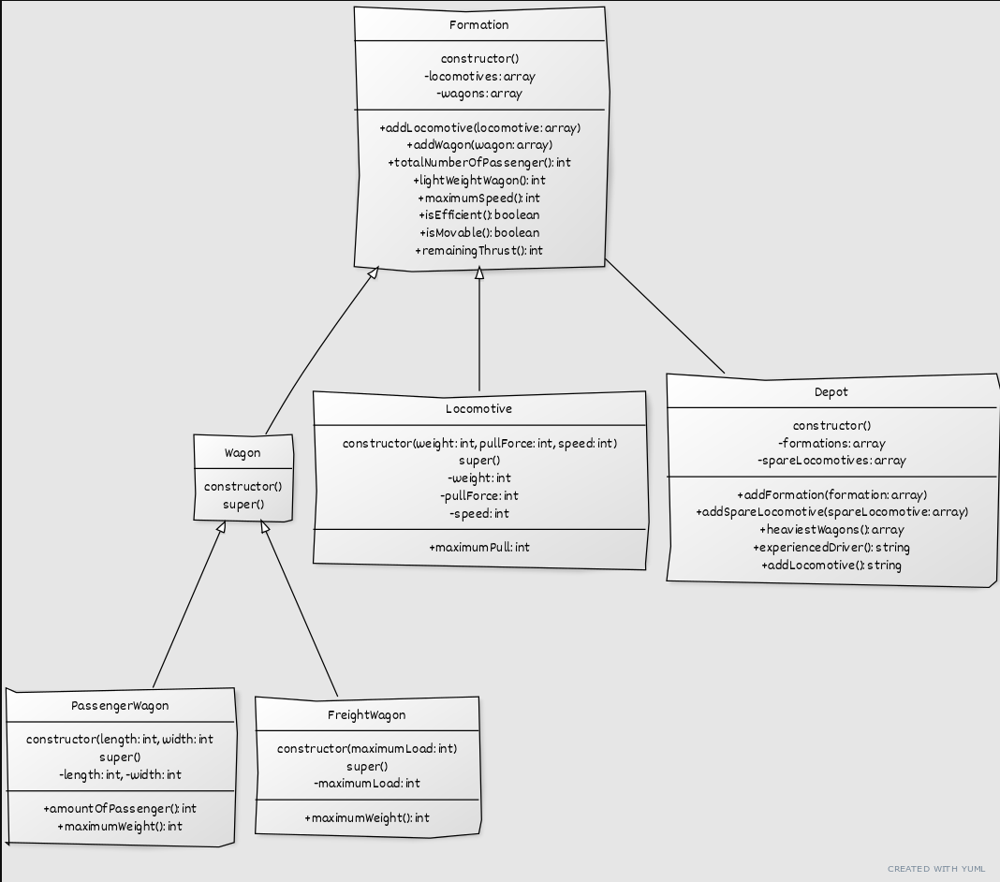

# This folder contains the solution to assignment two in the class Business and System Development. 
## Task description 
A railway administrator needs an application to help manage the formations available in different
depots. A formation is what we commonly refer to as a “train", comprising one or more
locomotives and one or more wagons. These wagons can be passenger cars or freight cars.
In each depot, you can find: pre-assembled formations, and loose locomotives that can be added
to a formation.
For each passenger wagon, we know its length in meters and its useful width in meters. The
number of passengers a passenger car can transport is as follows:
- If the useful width is up to 2.5 meters: length in meters * 8.
- If the useful width exceeds 2.5 meters: length in meters * 10.

For example, if we have two passenger wagons, both 10 meters long, one with a 2-meter width,
and the other with a 3-meter width, then the first can carry 80 passengers, and the second can
carry 100. A passenger car cannot carry cargo.

We also know the maximum load capacity in kilograms for each freight wagon. A freight car
cannot carry any passengers. There are no mixed-use wagons.

The maximum weight of a wagon, measured in kilograms, is calculated as follows:
- For a passenger car: the number of passengers it can carry * 80.
- For a freight car: the maximum load it can carry + 160 (accounting for two guards in each
freight car).

We have information about each locomotive, including its weight, the maximum weight it can pull,
and its maximum speed. For example, we may have a locomotive weighing 1000 kg, capable of
pulling up to 12,000 kg, with a maximum speed of 80 km/h. It's important to note that
locomotives must account for their own weight when calculating their pulling capacity. Therefore,
a locomotive with a maximum useful drag capacity of 12,000 kg can only pull 11,000 kg of
wagons, considering it weighs 1000 kg.

Model this scenario according to the object-oriented paradigm and write code in the Javascript
language to create at least two stereotypical formations/trains with one or more

Write the necessary code to be able to request the following information to the corresponding
objects:
1. The total number of passengers a formation can transport.
2. How many lightweight wagons a formation has; a wagon is considered lightweight if its
maximum weight is less than 2500 kg.
3. The maximum speed of a formation, which is the minimum among the maximum speeds of
the locomotives.
4. Whether a formation is efficient; it is efficient if each of its locomotives can pull at least 5 times
their weight (the weight of the locomotive itself).
5. Whether a formation can move. A formation can move if the total useful drag capacity of the
locomotives is greater than or equal to the total maximum weight of the wagons.
6. How many kilograms of thrust are missing for a formation to be able to move; it is 0 if it can
already move, and (total maximum weight of the wagons - total useful drag capacity of the
locomotives) otherwise.
7. Given a depot, identify the set consisting of the heaviest wagon from each formation; a set of
wagons is expected.
8. Whether a depot requires an experienced driver. A depot needs an experienced driver if any of
its formations are complex. A formation is considered complex if it has more than 20 units
(summing locomotives and wagons), or if the total weight (summing locomotives and wagons)
exceeds 10,000 kg.
9. Add a locomotive within a depot to a specific formation in such a way that the formation can
move. If the formation can already move, no action is taken. Otherwise, add a loose
locomotive from the depot if its useful drag capacity is greater than or equal to the missing
thrust needed for the formation to move. If no suitable loose locomotive is available, no
changes are made.
10. Provide a UML class diagram of the proposed complete solution
In other words, specify the required classes, instance variables for each class, messages that
instances of each class will understand, and write the corresponding methods for each task.

## How to run the code.
Download this file and open it with Visual Studio Code. 
Run the code and view the results in the output. 
### How to create your own formations
Guide to creating a formation:
- Initialize a new object with the class formation
  -  ``let formation3 = new Formation()``
- Create locomotives, passengerWagons, and freightWagons and give the arguments. 
  - ``let locomotive3 = new Locomotive(weight, pullForce, speed)``
  - ``let passengerWagon3 = new PassengerWagon(length, width)``
  - ``let freightWagon3 = new FreightWagon(maximumLoad)``
- Add the units to the formation
  - ``formation3.addLocomotive(locomotive3)``
  - ``formation3.addWagon(passengerWagon3)``
  - ``formation3.addWagon(freightWagon3)``
- Then add the newly created formation3 to the array ``trains``
  - ``let trains = [formation1, formation2, formation3];``
- Lastly, add the formation to the ``depot``
  - ``depot.addFormation(formation1)``

Now you have created a new formation. 
 
## UML Class Diagram

